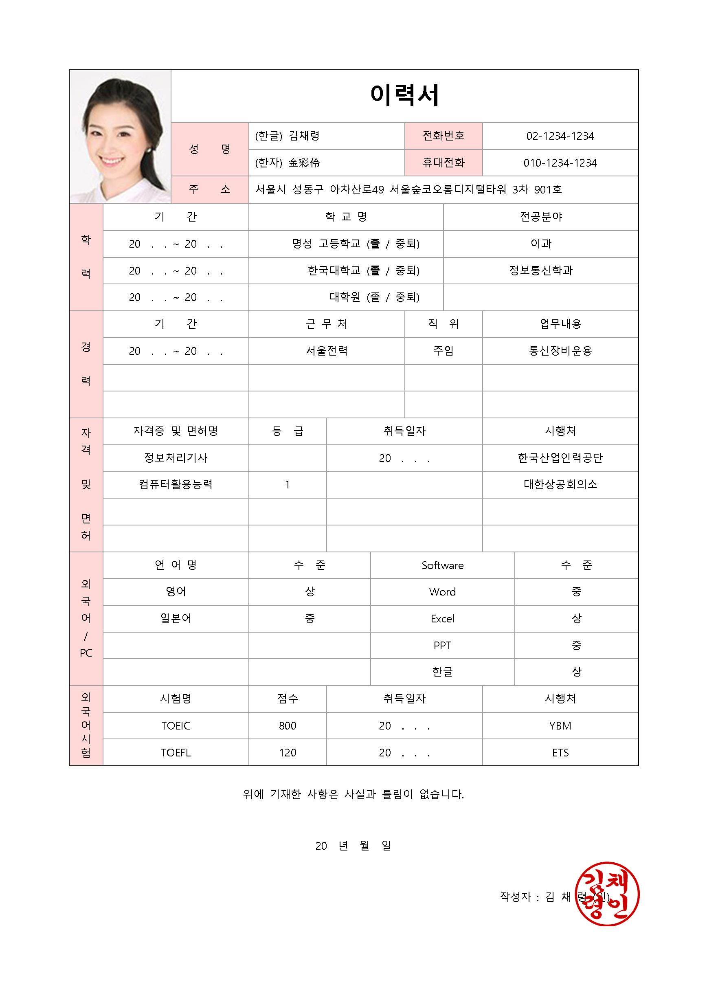

웹 기반 개인 포트폴리오 관리 시스템
=================

##### 포트폴리오란?
이력서와 자기소개서의 내용을 포함해 구체적이고 시각적으로 표현한 문서
* 이력 -> 지금까지 거쳐 온 학업, 직업, 경험 등의 내력
* 자기소개서 -> 본인을 소개하기 위한 목적으로 본인의 성장환경이나 장점들을 나열하여 타인에게 상세한 정보를 제공하고자 하는 문서

정의
-------
지금까지 거쳐 온 학업, 직업, 경험 등의 **내력**과 자신의 **업무적인 역량** 및 **이력에서 담지 못하는 자신의 장점**을 기록하여 관리

기능표
---------------------
<table>
    <tr>
        <td>기능</td>
        <td>세부설명</td>
        <td>비고</td>
    </tr>
    <tr>
        <td>수행 프로젝트 추가</td>
        <td>프로젝트 제목, 설명, 제작기간 등의 프로젝트에 대한 정보를 입력하여 저장</td>
        <td></td>
    </tr>
    <tr>
        <td>수행 프로젝트 수정</td>
        <td>이미 저장되어있는 수행 프로젝트 정보를 선택하여 내용을 수정</td>
        <td></td>
    </tr>
    <tr>
        <td>수행 프로젝트 삭제</td>
        <td>이미 저장되어있는 수행 프로젝트 정보를 선택하여 삭제</td>
        <td></td>
    </tr>
    <tr>
        <td>대외활동 추가</td>
        <td>대회 혹은 행사명과 주관 기간, 진행기간 등을 입력하여 대외활동 정보 추가</td>
        <td></td>
    </tr>
    <tr>
        <td>대외활동 수정</td>
        <td>이미 저장되어있는 대외활동 정보를 선택하여 내용을 수정</td>
        <td></td>
    </tr>
    <tr>
        <td>대외활동 삭제</td>
        <td>이미 저장되어있는 대외활동 정보를 선택하여 삭제</td>
        <td></td>
    </tr>
    <tr>
        <td>경력 추가</td>
        <td>직장명, 근무기간 등을 입력하여 경력 정보 추가</td>
        <td></td>
    </tr>
    <tr>
        <td>경력 수정</td>
        <td>이미 저장되어있는 경력 정보를 선택하여 내용 수정</td>
        <td></td>
    </tr>
    <tr>
        <td>경력 삭제</td>
        <td>이미 저장되어있는 경력 정보를 선택하여 삭제</td>
        <td></td>
    </tr>
    <tr>
        <td>자격증 추가</td>
        <td>자격명, 취득일자, 발급 기관을 입력하여 자격증에 대한 정보 추가</td>
        <td></td>
    </tr>
    <tr>
        <td>자격증 수정</td>
        <td>이미 저장되어있는 자격증 정보를 선택하여 내용 수정</td>
        <td></td>
    </tr>
    <tr>
        <td>자격증 삭제</td>
        <td>이미 저장되어있는 자격증 정보를 선택하여 삭제</td>
        <td></td>
    </tr>
</table>

#### 이력 종류

1. 수행 프로젝트
    - 프로젝트 제목
    - 프로젝트 부제
    - 프로젝트에 대한 설명
        * 참여 팀원, 프로그램의 강점 등
    - 제작 기간
    - PPT 파일
    - 소스코드
        * github 링크로 대체
2. 대외활동
    - 대회, 행사명
    - 주관 기관
    - 진행기간
    - 수상 여부
    - 연관 프로젝트
3. 경력
    - 직장명
    - 근무기간
    - 근무부서
    - 담당업무
4. 자격증
    - 자격명
    - 취득일자
    - 발급기관
5. 어학
    - 어학시험명
    - 점수
    - 취득일자
6. 학력
    - 구분(학사 / 석사 / 박사)
    - 전공
    - 수학구분(졸업 / 재학 / 수료 / 중퇴)
    - 학교명
    - 재학기간
    - 학위 논문
        * 논문명
        * 링크
7. 연락처
    - 구분(전화번호 / E-mail / SNS)
    - 내용

